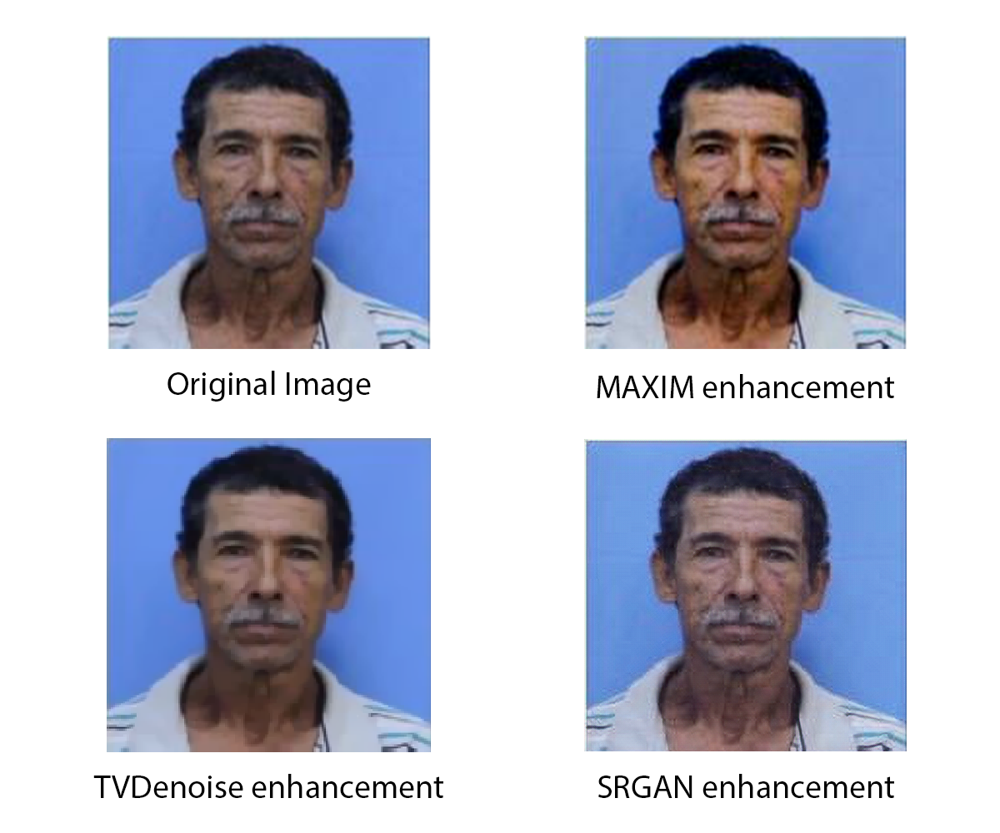

# TeLL-Me What You Can’t See: A Vision-Language Framework for Forensic Mugshot Augmentation

Abstract

## Method

We developed the tool using the following strategy:
  - Data Gathering/OSINT:
  - Image enhancement: the quality of the original picture is improved by means of multiple denoising generative strategies that aim at compensating several quality-impairing elements affecting the original image.
  - Linguistic description: A textual physical description of the subject is extracted using an LLM to guide the enhancement of the final picture.
  - Image augmentation: The LLM output is used as a prompt to guide the VLM image generation (i.e., the new artificially generated mugshot).
  - Evidence finalization: The augmented images, tested for similarity requirements, are correlated with the Hamming-based label descriptions, and the new synthetic poster is created.

### Image enhancement
In order to improve the quality of the input pictures, we compared three signal processing methods for image enhancement, addressing different image processing tasks.

* [MAXIM enhancement](./code/enhancement_models/maxim_script.py): This method is specialized in low-light enhancement, which is able to enhance lighting while reducing the image noise. 

* [Total variation denoising](./code/enhancement_models/tvdenoise_script.py): This technique reduces the total variation of the picture, facilitating the removal of unwanted details while minimizing the error compared with the original image.

* [SRGAN enhancement](./code/enhancement_models/srgan_script.py): This method aims to estimate a high-resolution image from its low-resolution counterpart.

  

### Linguistic description
The second component of our tool is represented by the linguistic description of the enhanced images, implemented through a Vision-Language Model. This task aims to automatically extract physical information about the subject from one picture, without requiring explicit previous knowledge of their identity. 
We compare two small-scale pre-trained VLMs.

* [Qwen-VL](./code/vlm_models/qwen_script.py): This small-scale VLM is composed by a pretrained vision encoder, a Vision-Language adapter, and a Large Language Model (Qwen-7B), and shows good performances on a broad range of visual-centric benchmarks.

* [TinyLLaVA](./code/vlm_models/tinyllava_script.py): The model is a small-scale large-multimodal architecture, composed by a pretrained vision encoder and a small-scale LLM, connected by a two-layer Multi-Layer Perceptron (MLP).

### Image augmentation
An Image-to-image model is used to generate new synthetic pictures of the subject, using as text prompt the information extracted in the previous phase.

* [PhotoMaker](./code/generative_models/photomaker_script.py): This generative model produces synthetic pictures while preserving the identity of the subjects, guided through the input text prompts.

## Results
The results of the first and third phases are collected into the [enhanced_pictures](./images/enhanced_pictures) and [Photomaker_generated_pictures](./images/Photomaker_generated_pictures) folders.

The results of the first and second phases are compared using a ["semantic" Hamming distance](./results/metric_computation.ipynb), which returns an accuracy score of the predictions w.r.t. the ground truth.
The results achieved using this method are collected into the [results](.main/results) folder.
