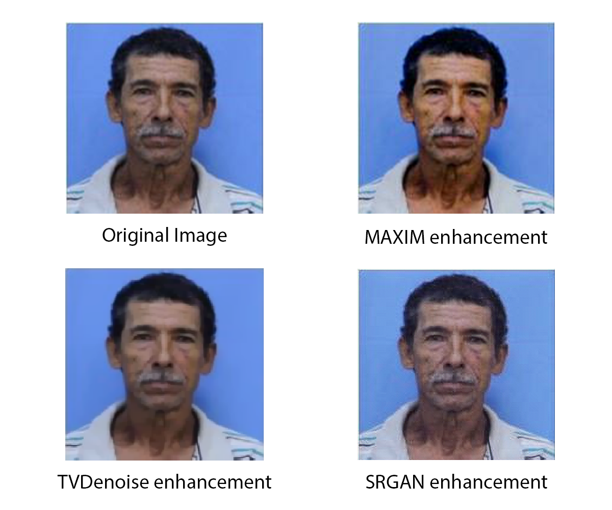
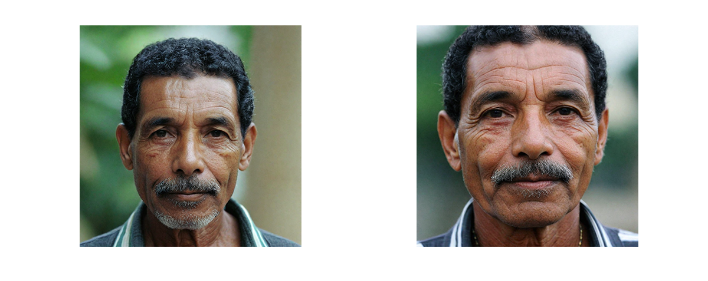

# TeLL-Me What You Can’t See: A Vision-Language Framework for Forensic Mugshot Augmentation

During criminal investigations, the availability of images depicting persons of interest directly influences the success of an identification procedures. However, law enforcement agencies often face challenges related to the scarcity of high-quality images or their obsolescence, which can affect the accuracy and success of people-search processes.

This paper introduces a novel forensic mugshot augmentation framework aimed at addressing these limitations. In order to assist law enforcement in identification procedures, our approach enhances visual evidence by creating synthetic, high-quality pictures through customizable data augmentation techniques. These are enabled by the combination of generative AI models and structured to preserve biometric identity and visual coherence with respect to the original data.

Experimental results demonstrate that our method consistently enriches multimedia data quality for forensic identification and provides several robust enhancements across multiple investigative scenarios. Such effectiveness has been validated by means of  both vision-based and evidence-based metrics supporting its potential as a tool for law enforcement applications.

Attribute extraction reached $84.1\%$ (+2.3 percentage points over the original mugshots), and re-identification indicated strong identity preservation: similarity for same-subject pairs $\sim 0.89$ vs. $\sim 0.19$ for different-subject pairs. These results suggest that the framework reliably extracts and leverages the required target characteristics, with no notable hallucinations observed.

## Method
We developed the tool using the following strategy:
  - Data Gathering/OSINT:
  - Image enhancement: the quality of the original picture is improved by means of multiple denoising generative strategies that aim at compensating several quality-impairing elements affecting the original image.
  - Linguistic description: A textual physical description of the subject is extracted using an LLM to guide the enhancement of the final picture.
  - Image augmentation: The LLM output is used as a prompt to guide the VLM image generation (i.e., the new artificially generated mugshot).
  - Evidence finalization: The augmented images, tested for similarity requirements, are correlated with the Hamming-based label descriptions, and the new synthetic poster is created.

### Image enhancement
In order to improve the quality of the input pictures, we compared three signal processing methods for image enhancement, addressing different image processing tasks.

* [MAXIM enhancement](./code/enhancement_models/maxim_script.py): This method is specialized in low-light enhancement, which is able to enhance lighting while reducing the image noise. 

* [Total variation denoising](./code/enhancement_models/tvdenoise_script.py): This technique reduces the total variation of the picture, facilitating the removal of unwanted details while minimizing the error compared with the original image.

* [SRGAN enhancement](./code/enhancement_models/srgan_script.py): This method aims to estimate a high-resolution image from its low-resolution counterpart.

  

### Linguistic description
The second component of our tool is represented by the linguistic description of the enhanced images, implemented through a Vision-Language Model. This task aims to automatically extract physical information about the subject from one picture, without requiring explicit previous knowledge of their identity. 
We compare two small-scale pre-trained VLMs.

* [Qwen-VL](./code/vlm_models/qwen_script.py): This small-scale VLM is composed by a pretrained vision encoder, a Vision-Language adapter, and a Large Language Model (Qwen-7B), and shows good performances on a broad range of visual-centric benchmarks.

* [TinyLLaVA](./code/vlm_models/tinyllava_script.py): The model is a small-scale large-multimodal architecture, composed by a pretrained vision encoder and a small-scale LLM, connected by a two-layer Multi-Layer Perceptron (MLP).

### Synthetic image generation
An Image-to-image model is used to generate new synthetic pictures of the subject, using as text prompt the information extracted in the previous phase.

* [PhotoMaker](./code/generative_models/photomaker_script.py): This generative model produces synthetic pictures while preserving the identity of the subjects, guided through the input text prompts.

  

### Evidence finalization
The generated images are compared for similarity with the original mugshots using two re-identification models:
 * [DeepFace](./code/re-id_models/deepface_script.py): deep learning classification method that  uses an Euclidean embedding of faces.

 * [Recognito](https://github.com/recognito-vision): a facial recognition system that positioned among the top systems in both the 1:1 verification and 1:N identification scenarios during the NIST Face Recognition Technology Evaluation.

## Results

The results of the image enhancement phase are collected in the folder [enhanced_images](./images/mugshots/enhanced_images/).

The linguistic descriptions of the images are compared using the ["semantic" Hamming distance](./results/mugshots/semantic_hamming_distance/metric_computation.ipynb), which returns an accuracy score of the predictions w.r.t. the ground truth. 

The generated synthetic images are collected in the folder [generated_images](./images/mugshots/generated_images/).

The results of both the "semantic" Hamming distance and the re-identification phase are collected in the folder [results/mugshots](./results/mugshots/).
In the folder [results/aging_deaging](./results/aging_deaging/) the results of the aging and deaging tasks are presented.